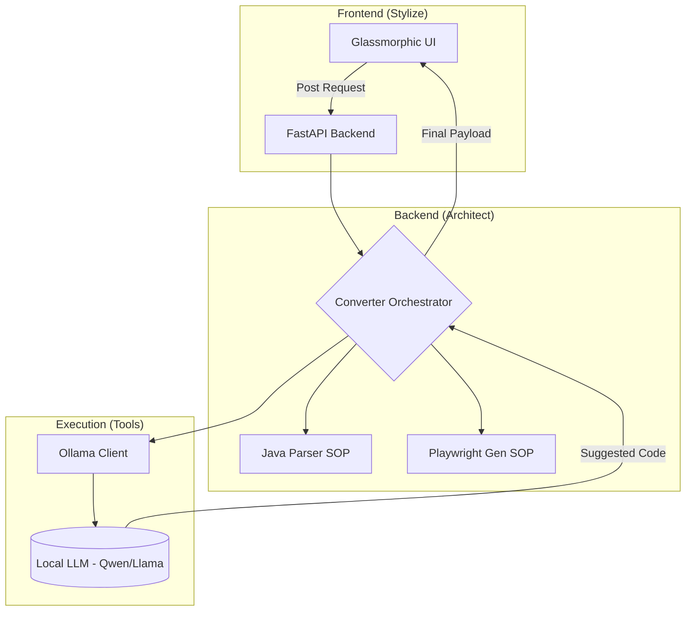

# B.L.A.S.T. Converter 🚀
### Selenium Java to Playwright JS/TS Converter

B.L.A.S.T. (Blueprint, Link, Architect, Stylize, Trigger) is an AI-powered automation converter that transforms legacy Selenium/TestNG Java code into modern Playwright (JavaScript/TypeScript) scripts using a Local LLM (Ollama).


## 🏗️ Architecture

The system follows the **A.N.T. 3-Layer Architecture** (Architecture, Navigation, Tools) to ensure deterministic results from probabilistic LLM outputs.



## ✨ Features

- **Local LLM Integration:** Privacy-first conversion using Ollama (no cloud API leakes).
- **Glassmorphic UI:** Modern side-by-side workspace for instant comparison.
- **Smart Mapping:** Intelligent conversion of Selenium locators, actions, and assertions.
- **Protocol-Driven:** Built using the B.L.A.S.T. protocol for maximum reliability.

## 🛠️ Tech Stack

- **Backend:** Python, FastAPI, Uvicorn
- **LLM Engine:** Ollama (Qwen2/Llama3)
- **Frontend:** Vanilla JS, CSS (Glassmorphism), HTML5
- **Protocols:** B.L.A.S.T. Master System Prompt

## 🚀 Getting Started

### Prerequisites
- Install [Ollama](https://ollama.ai/)
- Pull a lightweight model: `ollama pull qwen2:0.5b`

### Installation
1. Clone the repository:
   ```bash
   git clone https://github.com/Manasi-Rani-Padhi/Project2-Selenium2PlaywrightConversionLocalLLM.git
   cd Project2-Selenium2PlaywrightConversionLocalLLM
   ```

2. Install dependencies:
   ```bash
   pip install fastapi uvicorn requests pydantic
   ```

3. Run the application:
   ```bash
   bash run.sh
   ```

4. Open in browser: `http://localhost:8000`

## 📂 Project Structure

- `tools/`: Deterministic Python engines (Ollama client, Logic).
- `architecture/`: Technical SOPs defining the conversion rules.
- `static/`: Frontend assets (UI styles and logic).
- `app.py`: FastAPI gateway.

---
Built with ❤️ using the **B.L.A.S.T. Protocol**.
